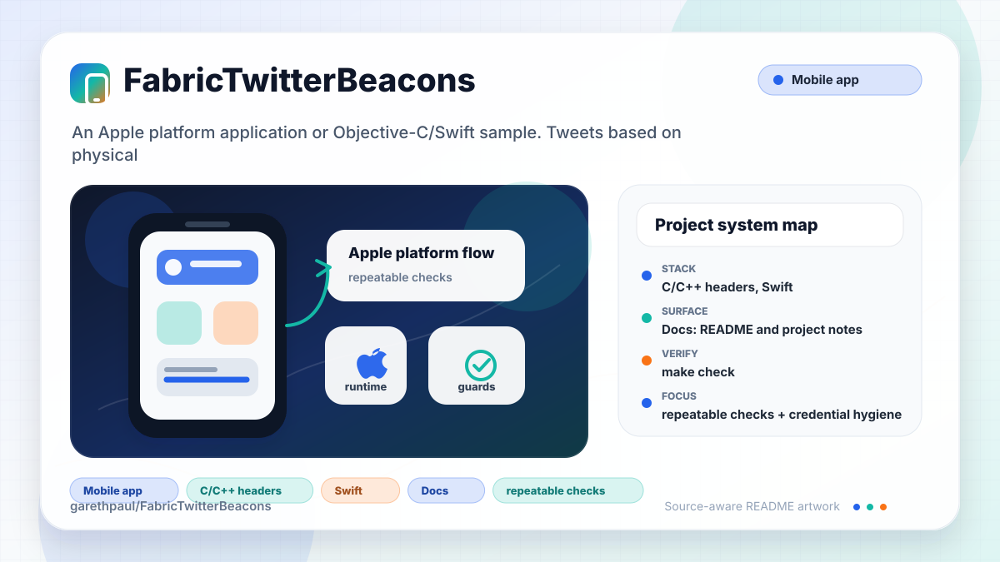

# FabricTwitterBeacons

<!-- README-OVERVIEW-IMAGE -->


## Overview

`garethpaul/FabricTwitterBeacons` is an Apple platform application or Objective-C/Swift sample. Tweets based on physical proximity to iBeacons. 

This README is based on the checked-in source, manifests, scripts, and repository metadata on the `master` branch. The project language mix found during review was: C/C++ headers (21), Swift (12).

## Repository Contents

- `README.md` - project overview and local usage notes
- `Fabric.framework` - source or example code
- `Makefile` - local maintenance check entry point
- `SECURITY.md` - security reporting and disclosure guidance
- `scripts/check-baseline.sh` - static baseline verification for Fabric secrets and beacon logging
- `settee` - source or example code
- `settee.xcodeproj` - Xcode project file
- `setteeTests` - source or example code
- `TwitterKit.framework` - source or example code
- `VISION.md` - project direction and maintenance guardrails

Additional scan context:

- Source directories: Fabric.framework, TwitterKit.framework, settee, setteeTests
- Dependency and build manifests: none detected
- Entry points or build surfaces: settee.xcodeproj
- Test-looking files: setteeTests/Info.plist, setteeTests/setteeTests.swift

## Getting Started

### Prerequisites

- Git
- macOS with Xcode for building Apple platform projects

### Setup

```bash
git clone https://github.com/garethpaul/FabricTwitterBeacons.git
cd FabricTwitterBeacons
```

The setup commands above are derived from repository files. Legacy mobile, Python, or JavaScript samples may require older SDKs or package versions than a modern workstation uses by default.

## Running or Using the Project

- Open `settee.xcodeproj` in Xcode, choose the app or sample scheme, and run it on the matching simulator/device.
- Configure `FABRIC_API_KEY` and `FABRIC_BUILD_SECRET` in your local Xcode scheme or build environment if you need the legacy Fabric upload phase. The checked-in project skips Fabric upload when those variables are absent.
- Beacon ranging is a physical-device workflow. Verify proximity behavior on real iOS hardware with a test beacon before relying on it.

## Testing and Verification

Run the repository baseline:

```bash
make check
```

The baseline verifies that Fabric credentials are not committed, raw beacon
payloads and account-specific Twitter details are not logged, local credential
files stay ignored, the app `Info.plist` carries location usage copy for beacon
ranging, malformed Twitter search JSON completes with an empty result,
malformed Twitter REST JSON fails closed without force-unwrapping,
beacon-triggered tweet loads are bounded and non-overlapping, and the Xcode
project can be listed when `xcodebuild` is installed.

For functional verification, use Xcode's test action or `xcodebuild test` with
the appropriate scheme and destination.

When the required SDK or runtime is unavailable, use static checks and source review first, then verify on a machine that has the matching platform toolchain.

## Configuration and Secrets

- Detected references to Twitter. Keep API keys, OAuth credentials, tokens, and account-specific values in local configuration only.
- Keep `FABRIC_API_KEY`, `FABRIC_BUILD_SECRET`, Twitter credentials, signing identities, and local `.xcconfig` files out of source control.
- Keep the checked-in app `Info.plist` limited to bundle metadata and reviewed
  privacy usage descriptions; do not add secrets to it.
- Treat iBeacon UUIDs and proximity behavior as sensitive physical-device configuration. Do not log beacon payloads or user proximity transitions without a reviewed need.
- Do not log Twitter usernames, tweet IDs, raw API errors, or account-specific
  response details from beacon-triggered flows.
- Beacon-triggered tweet loading skips empty search results and suppresses
  overlapping guest tweet-load requests.
- Malformed Twitter search JSON completes with an empty result instead of
  force-unwrapping the response body.
- Malformed Twitter REST JSON in the legacy REST helper fails closed instead of
  force-unwrapping the response body.

## Security and Privacy Notes

- Review changes touching authentication or token handling; examples from the scan include TwitterKit.framework/Versions/A/Headers/DGTAuthenticateButton.h, TwitterKit.framework/Versions/A/Headers/DGTSession.h, TwitterKit.framework/Versions/A/Headers/Digits.h, TwitterKit.framework/Versions/A/Headers/TWTRAPIErrorCode.h, and 6 more.
- Review changes touching external API calls or credential-adjacent configuration; examples from the scan include Fabric.framework/Versions/A/Headers/Fabric.h, Fabric.framework/Versions/A/Resources/Info.plist, TwitterKit.framework/Versions/A/Headers/DGTAuthenticateButton.h, TwitterKit.framework/Versions/A/Headers/DGTConstants.h, and 6 more.
- Review changes touching network requests, sockets, or service endpoints; examples from the scan include Fabric.framework/Versions/A/Resources/Info.plist, TwitterKit.framework/Versions/A/Headers/TWTRAPIClient.h, TwitterKit.framework/Versions/A/Headers/TWTRAPIErrorCode.h, TwitterKit.framework/Versions/A/Headers/TWTROAuthSigning.h, and 6 more.
- Review changes touching mobile permissions or privacy-sensitive device data; examples from the scan include TwitterKit.framework/Versions/A/Headers/TWTRConstants.h, settee/ViewController.swift.
- Review changes touching file, media, JSON, XML, CSV, OCR, or data parsing; examples from the scan include Fabric.framework/Versions/A/Resources/Info.plist, TwitterKit.framework/Versions/A/Headers/TWTRAPIClient.h, TwitterKit.framework/Versions/A/Headers/TWTRComposer.h, TwitterKit.framework/Versions/A/Headers/TWTROAuthSigning.h, and 6 more.
- Review changes touching database, model, or persistence code; examples from the scan include TwitterKit.framework/Versions/A/Headers/TWTRTweetTableViewCell.h, TwitterKit.framework/Versions/A/Headers/TWTRTweetViewDelegate.h, settee/ViewController.swift.

## Maintenance Notes

- This looks like an Apple platform project or sample. Xcode, Swift, CocoaPods, and deployment target versions may need to match the original project era.
- Run `make check` before pushing changes that touch the Xcode project, Fabric/Twitter integration, or beacon code.
- See `SECURITY.md` for vulnerability reporting and safe research guidance.
- See `VISION.md` for project direction and contribution guardrails.
- See `docs/plans/2026-06-09-twitter-rest-json-guard.md` for the legacy REST
  helper JSON parsing guard.

## Contributing

Keep changes small and tied to the project that is already present in this repository. For code changes, document the toolchain used, avoid committing generated dependency directories or local configuration, and update this README when setup or verification steps change.
